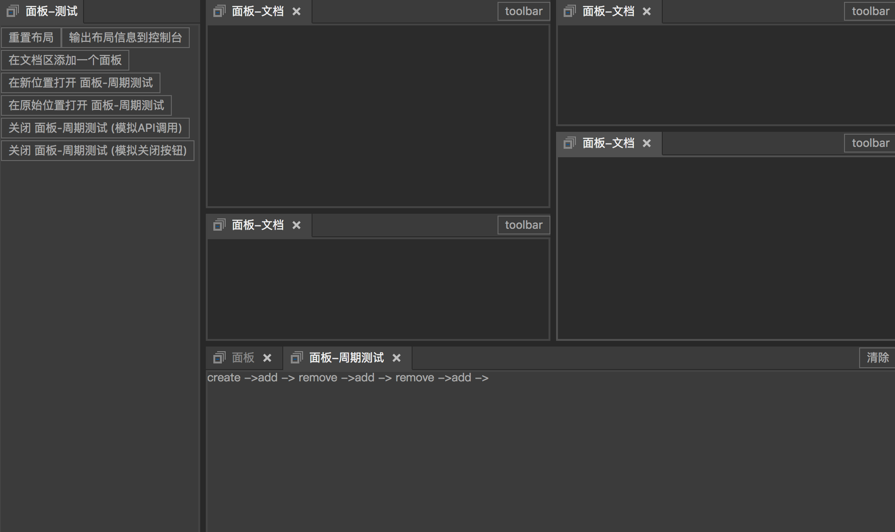

# box-layout
盒式布局，用于搭建灵活的多面板Web应用程序。
* 支持"文档"区
* 支持面板自定义工具栏
* 支持自定义主题
## 预览

## 如何运行
1. ```npm install```（请确保本机已经安装Node.js）
2. ```npm run build```
3. 用浏览器打开```./dist```下面的```index.html```

## 项目结构说明
此项目为测试项目，```./src```为测试代码。合式布局的源码包含在```./boxlayout```目录中，执行```npm run build-lib```可单独编译该项目
